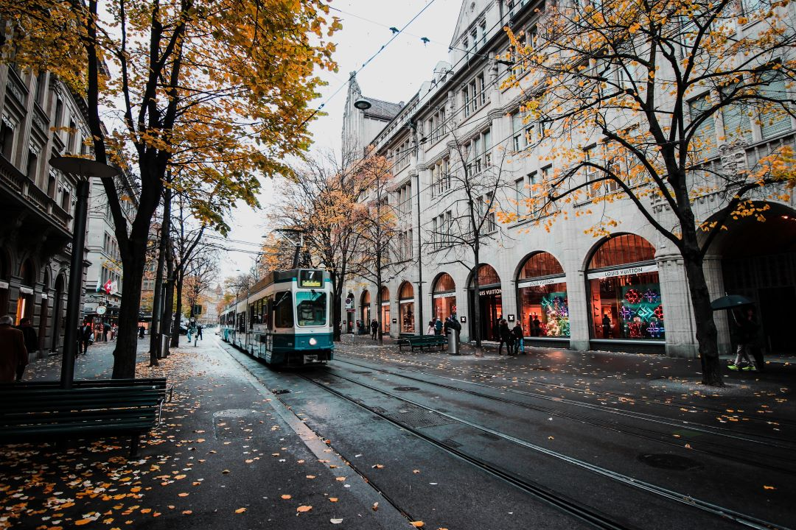

# Switzerland Tourism Website

An immersive, interactive website showcasing the beauty and culture of Switzerland, built while learning web development.

## Features

🏔️ **Immersive Experience**
- Full-screen video background of Swiss landscapes
- Smooth scroll-triggered animations using GSAP
- Responsive design for all device sizes

🗺️ **Interactive Content**
- Auto-scrolling carousels for Swiss specialties and cantons
- Hover effects on all interactive elements
- Animated text scrollers for cities and attractions
- Image galleries for each Swiss canton

📚 **Comprehensive Information**
- Detailed sections about Swiss culture, cuisine, and tourism
- Interactive cards highlighting places to stay, tourist locations, and food
- Wikipedia links for all major cities and attractions

## Technical Implementation

- **Frontend**: HTML5, CSS3, JavaScript (vanilla)
- **Libraries**:
  - [GSAP](https://greensock.com/gsap/) - For scroll animations and transitions
  - [Font Awesome](https://fontawesome.com/) - Icons
  - [Google Fonts](https://fonts.google.com/) - Multiple font families for visual hierarchy
- **Features**:
  - Pure CSS animations and transitions
  - Responsive carousels with manual controls
  - Optimized video background
  - Semantic HTML structure

## About the Project

Built as a learning project while studying web development, this website demonstrates:
- Advanced CSS techniques (animations, transitions, flexbox)
- JavaScript DOM manipulation
- GSAP animation library implementation
- Responsive design principles
- Interactive UI/UX elements

The project showcases my progression in frontend development skills while creating an engaging tourism showcase.
